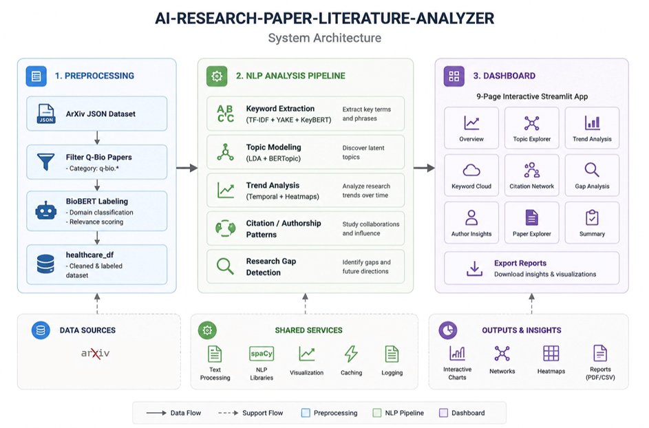

# 🏥 Healthcare Research Literature Analyzer

An end-to-end NLP pipeline for analyzing healthcare research papers from the **ArXiv q-bio** dataset. The project covers everything from raw data preprocessing to an interactive multi-page Streamlit dashboard — helping researchers discover trends, research gaps, and emerging topics in the biomedical domain.

---
# Dashboard Demonstration Video

🎥 Demo Video: [Watch Here](https://drive.google.com/drive/folders/1enAAhLiWxwbOitYTrq2LfqYRgim0B6a6?usp=sharing)
🎥 Demo Video on YouTube: [Watch Here](https://youtu.be/IGDHcBll_sc).

---
## Architecuture

<p align="center">
  
</p>

---
## 📁 Project Structure

```
├── Dataset_preprocessing.ipynb        # Step 1 — Data extraction, filtering & labeling
├── Research_Literature_Analyzer.ipynb # Step 2 — Full NLP analysis pipeline
├── dashboard.ipynb                    # Step 3 — Streamlit dashboard (via Google Colab + ngrok)
└── README.md
```

---

## 🔄 Pipeline Overview

```
ArXiv JSON Dataset
       │
       ▼
┌─────────────────────┐
│  1. Preprocessing   │  → Filter q-bio papers → BioBERT labeling → healthcare_df
└─────────────────────┘
       │
       ▼
┌─────────────────────────────────────────────────────┐
│  2. NLP Analysis Pipeline                           │
│                                                     │
│  Keyword Extraction (TF-IDF + YAKE + KeyBERT)       │
│       → Topic Modeling (LDA + BERTopic)             │
│       → Trend Analysis (Temporal + Heatmaps)        │
│       → Citation / Authorship Patterns              │
│       → Research Gap Detection                      │
└─────────────────────────────────────────────────────┘
       │
       ▼
┌─────────────────────┐
│  3. Dashboard       │  → 9-page interactive Streamlit app
└─────────────────────┘
```

---

## 📓 Notebook 1 — `Dataset_preprocessing.ipynb`

Handles all raw data ingestion and labeling before analysis begins.

**What it does:**

- Loads the ArXiv metadata snapshot (`arxiv-metadata-oai-snapshot.json`) in chunks to handle its large size efficiently
- Scans all paper categories and filters to **q-bio** (quantitative biology / healthcare) papers only
- Selects relevant columns: `id`, `title`, `abstract`, `authors`, `categories`, `update_date`, `doi`, etc.
- Filters papers published from **2015 onwards**
- Extracts the publication year from `update_date`
- Uses **BioBERT** (`dmis-lab/biobert-base-cased-v1.1`) to classify each abstract as healthcare-relevant (`label = 1`) or not (`label = 0`)
- Saves the labeled dataset as `medical_with_labels.csv`
- Filters down to only healthcare-labeled rows for further analysis
- Visualizes the **research publication trend over time**

**Key libraries:** `pandas`, `transformers`, `torch`, `tqdm`, `matplotlib`, `seaborn`

---

## 📓 Notebook 2 — `Research_Literature_Analyzer.ipynb`

The core NLP analysis notebook. Runs a comprehensive pipeline across 14+ steps on the **26,125 healthcare-labeled papers**.

### 🔑 Step 5 — Keyword Extraction

Three complementary methods are used and compared:

| Method | Approach | Output |
|---|---|---|
| **TF-IDF** | Statistical term frequency | Global corpus-level keywords |
| **YAKE** | Statistical, unsupervised | Per-abstract keywords |
| **KeyBERT** | Semantic (MiniLM embeddings) | Context-aware keyphrases |

Outputs: bar charts comparing all three methods + a **word cloud** of the full corpus.

### 🗂️ Step 6 — Topic Modeling

- **LDA (Latent Dirichlet Allocation)** — 10 topics extracted, each with human-readable labels covering: *Genomics, Deep Learning, Protein Structure, Epidemiology, Neuroscience, Brain Networks, Cell Biology, Evolutionary Biology, Dynamical Systems, and Cancer Research*
- **BERTopic** — transformer-based topic modeling with auto-detected topic count; produces inter-topic distance maps and bar charts

### 📈 Step 7 — Trend Analysis

- Annual and cumulative publication counts over time
- Per-topic publication trends plotted as line charts
- **Topic Activity Heatmap** (normalized, Year × Topic) to visualize activity shifts

### 🔗 Step 8 — Keyword Co-occurrence Network

- Builds a co-occurrence graph using `networkx`
- Calculates degree centrality to find the most influential research keywords
- Visualizes keyword clusters and their interconnections

### 👥 Steps 9–10 — Citation & Authorship Patterns

- Top contributing authors ranked by paper count
- Author collaboration trends over time
- NER-based entity extraction using `spaCy`
- Author distribution plots

### 🚀 Step 11 — Research Gap Detection & Emerging Domains

- **Keyword velocity analysis** — measures rate-of-change of keyword frequency over the last 5 years to identify *emerging* vs *declining* topics
- **Bubble chart** — maps each topic by size, average publication year, and recent growth proportion
- Saves `potential_research_gaps.csv` with gap scores

### 🗺️ Step 12 — UMAP Paper Clustering

- Generates 2D UMAP projections of all papers based on TF-IDF embeddings
- Papers colored by dominant LDA topic
- Interactive scatter plot saved as HTML

### 📊 Step 13 — ArXiv Category Analysis

- Pie chart of top 12 ArXiv sub-categories
- Line chart showing publication trends for the top 5 categories since 2015

**Key libraries:** `scikit-learn`, `bertopic`, `sentence-transformers`, `keybert`, `yake`, `rake-nltk`, `umap-learn`, `hdbscan`, `networkx`, `spacy`, `nltk`, `plotly`, `seaborn`, `wordcloud`

---

## 📓 Notebook 3 — `dashboard.ipynb`

Builds and serves a full **Streamlit dashboard** from Google Colab using `pyngrok` for public access.

### 🖥️ Dashboard Pages (9 sections)

| Page | Description |
|---|---|
| **Overview** | Key metrics (total papers, topics, avg authors), dataset preview, yearly distribution, category charts |
| **Research Trends** | Publication growth area chart, dominant topic bar chart, topic trends over time |
| **Topic Modeling** | LDA topic word summaries, topic confidence histogram, BERTopic interactive bar chart |
| **Keyword Analysis** | Top TF-IDF keywords, healthcare word cloud, keyword comparison chart (TF-IDF vs YAKE vs KeyBERT) |
| **Author Analysis** | Top contributing authors, author distribution visualization |
| **Research Gaps** | Research gap growth chart, gap score scatter plot, sortable gap table |
| **Emerging Domain Detection** | Keyword velocity chart showing fastest growing/declining research areas |
| **Paper Explorer** | Filter papers by year, search by title, browse metadata table |
| **Interactive Visuals** | Dropdown to select and render any saved HTML visualization (UMAP, bubble chart, topic trends, etc.) |

**Key libraries:** `streamlit`, `streamlit-option-menu`, `plotly`, `pandas`, `Pillow`, `pyngrok`

---

## 🚀 Getting Started

### Prerequisites

- Python 3.8+
- Google Colab (recommended for GPU support during BioBERT inference and BERTopic)
- The ArXiv metadata dataset: [`arxiv-metadata-oai-snapshot.json`](https://www.kaggle.com/datasets/Cornell-University/arxiv)

### Installation

```bash
pip install pandas numpy matplotlib seaborn plotly
pip install transformers torch tqdm
pip install keybert yake rake-nltk
pip install bertopic sentence-transformers
pip install umap-learn hdbscan networkx
pip install scikit-learn wordcloud spacy
python -m spacy download en_core_web_sm
pip install streamlit streamlit-option-menu pyngrok Pillow
```

### Running the Pipeline

**Step 1 — Preprocess the data:**
Open and run `Dataset_preprocessing.ipynb`. Update the `path` variable to point to your local copy of `arxiv-metadata-oai-snapshot.json`. The notebook saves `medical_with_labels.csv`.

**Step 2 — Run the NLP analysis:**
Open and run `Research_Literature_Analyzer.ipynb`. Point the data loader to `medical_with_labels.csv` (or mount from Google Drive). All output files (CSVs, PNGs, HTMLs) are saved to the working directory.

**Step 3 — Launch the dashboard:**
Open and run `dashboard.ipynb` in Google Colab. Update `DATA_PATH` to point to your output files folder on Google Drive. The notebook starts the Streamlit server and opens a public `ngrok` URL.

---

## 📦 Output Files

After running the full pipeline, the following files are generated:

| File | Description |
|---|---|
| `healthcare_papers_enriched.csv` | Main enriched dataset with topic labels |
| `top_keywords_tfidf.csv` | Top 100 TF-IDF keywords with scores |
| `top_keywords_yake.csv` | Top 100 YAKE keywords |
| `top_keywords_keybert.csv` | Top 100 KeyBERT keyphrases |
| `lda_topic_words.csv` | LDA topic-word assignments |
| `keyword_network_centrality.csv` | Co-occurrence network centrality scores |
| `potential_research_gaps.csv` | Research gap candidates with gap scores |
| `keywords_comparison.png` | Side-by-side keyword method comparison |
| `wordcloud_healthcare.png` | Word cloud of the corpus |
| `topic_heatmap.png` | Year × Topic activity heatmap |
| `keyword_cooccurrence_network.png` | Keyword network graph |
| `keyword_velocity.png` | Emerging vs declining keyword chart |
| `umap_paper_clusters.html` | Interactive UMAP scatter plot |
| `topic_bubble_chart.html` | Topic size vs growth bubble chart |
| `research_gap_growth.html` | Research gap interactive chart |
| `publication_trends.html` | Annual & cumulative publication chart |
| `bertopic_barchart.html` | BERTopic top terms bar chart |

---

## 🛠️ Tech Stack

| Category | Tools |
|---|---|
| **Data Processing** | `pandas`, `numpy` |
| **NLP & ML** | `scikit-learn`, `spaCy`, `NLTK`, `transformers` (BioBERT) |
| **Keyword Extraction** | `TF-IDF`, `YAKE`, `KeyBERT` (MiniLM) |
| **Topic Modeling** | `LDA` (scikit-learn), `BERTopic` |
| **Dimensionality Reduction** | `UMAP`, `HDBSCAN` |
| **Network Analysis** | `networkx` |
| **Visualization** | `matplotlib`, `seaborn`, `plotly`, `wordcloud` |
| **Dashboard** | `Streamlit`, `streamlit-option-menu` |
| **Deployment** | Google Colab + `pyngrok` |

---

## 📊 Dataset

- **Source:** [ArXiv Dataset — Kaggle](https://www.kaggle.com/datasets/Cornell-University/arxiv)
- **Domain filter:** `q-bio` (quantitative biology) categories
- **Label filter:** BioBERT-classified healthcare papers (`label = 1`)
- **Final dataset size:** ~26,119 papers
- **Year range:** 2015 – present

---
## 👨‍💻 Team Members
- Harshit Yadav
- Lakshya Joshi
- Raj Verma

---

## 🎓 Mentor
**Dr. Sahinur Rahman Laskar**<br>
Assistant Professor (Senior Scale)<br>
School of Computer Science, UPES, Dehradun, India<br>
Email: sahinurlaskar.nits@gmail.com / sahinur.laskar@ddn.upes.ac.in<br>


## 🤝 Contributing

Pull requests are welcome. For major changes, please open an issue first to discuss what you would like to change.

---
